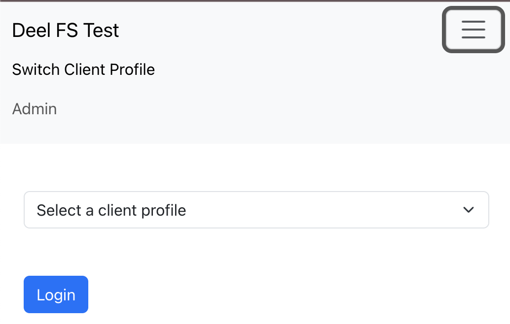
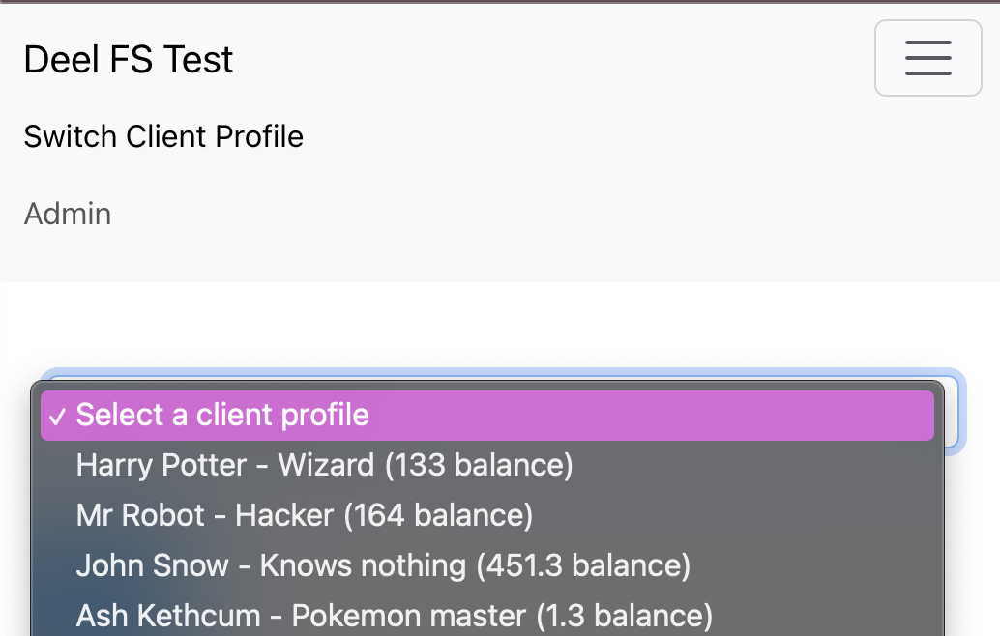
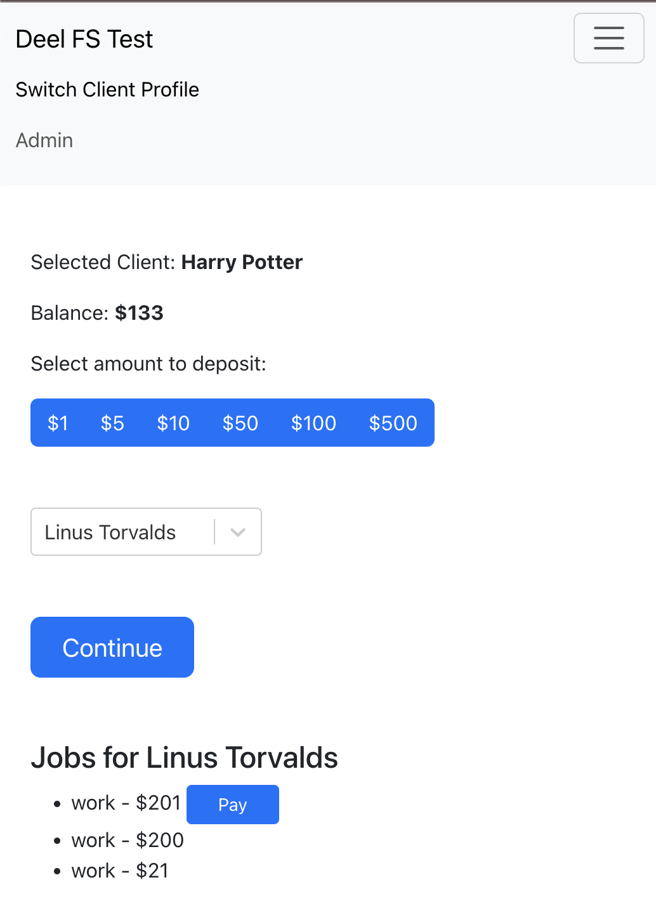
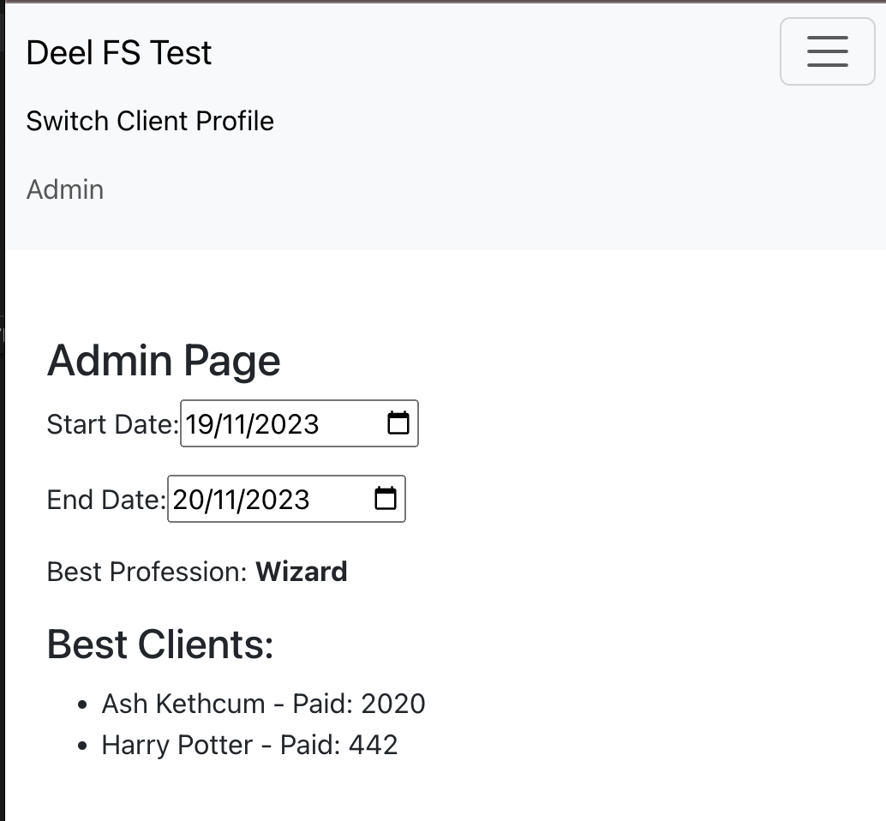

# DEEL FULLSTACK TASK

💫 Welcome! 🎉

This full-stack exercise involves building a Node.js/Express.js app that will serve a REST API, as well as a React App that will use data from the API. We imagine you should spend around 3 hours at implement this feature.

## Data Models

> **All models are defined in src/model.js**

### Profile

A profile can be either a `client` or a `contractor`.
clients create contracts with contractors. contractor does jobs for clients and get paid.
Each profile has a balance property.

### Contract

A contract between and client and a contractor.
Contracts have 3 statuses, `new`, `in_progress`, `terminated`. contracts are considered active only when in status `in_progress`
Contracts group jobs within them.

### Job

contractor get paid for jobs by clients under a certain contract.

## Getting Set Up

The exercise requires [React](https://reactjs.org/) and [Node.js](https://nodejs.org/en/) to be installed. We recommend using the LTS version (Gallium or later) of Node and React 18 or later. For bootstrapping your react app, feel free to use CRA, a vite template, or a solution of your own devising. **You will be creating the front-end from scratch**

1. Start by creating a local repository for this folder.

1. In the repo root directory, run `npm install` to gather all dependencies.

1. Next, `npm run seed` will seed the local SQLite database. **Warning: This will drop the database if it exists**. The database lives in a local file `database.sqlite3`.

1. Then run `npm start` which should start both the server and the React client.

❗️ **Make sure you commit all changes to the master branch!**

## Technical Notes

- The server is running with [nodemon](https://nodemon.io/) which will automatically restart for you when you modify and save a file.

- The database provider is SQLite, which will store data in a file local to your repository called `database.sqlite3`. The ORM [Sequelize](http://docs.sequelizejs.com/) is on top of it. You should only have to interact with Sequelize - **please spend some time reading sequelize documentation before starting the exercise.**

- To authenticate users use the `getProfile` middleware that is located under src/middleware/getProfile.js. users are authenticated by passing `profile_id` in the request header. after a user is authenticated his profile will be available under `req.profile`. make sure only users that are on the contract can access their contracts.
- The server is running on port 3001.

## Full stack feature to implement

### User flow
1. User will be presented a drop-down of profiles (of type `client`), with a login button
1. User will select a profile, and log in
1. User will be presented the main interface with the following elements:
    1. User will have buttons available to deposit pre-set amounts (1, 5, 10, 50, 100, 500) on the interface at all times — clicking these buttons will create a deposit and update the balance
    1. User will see the logged in profile's balance on the interface at all times
    1. User will be presented a home screen with an auto-complete field which will also be populated by profiles (of type `contractor`) with the label "Pay Jobs for…" and a button labeled "Continue"
1. User will be able to select a profile and continue
1. User will be presented with a list of paid & unpaid jobs for the selected contractor
1. User will be able to pay an unpaid job with a button click. User should not be able to pay a job for which the paying profile does not have sufficient balance.

## APIs To Implement (these support your feature)

Below is a list of the required API's for the application.

1. **_GET_** `/profiles` - Returns a list of profiles, useful for your login

1. **_GET_** `/jobs/unpaid` - Get all unpaid jobs for a user (**_either_** a client or contractor), for **_active contracts only_**.

1. **_POST_** `/jobs/:job_id/pay` - Pay for a job, a client can only pay if his balance >= the amount to pay. The amount should be moved from the client's balance to the contractor balance.

1. **_POST_** `/balances/deposit/:userId` - Deposits money into the the the balance of a client, a client can't deposit more than 25% his total of jobs to pay. (at the deposit moment)

1. **_GET_** `/admin/best-profession?start=<date>&end=<date>` - Returns the profession that earned the most money (sum of jobs paid) for any contactor that worked in the query time range.

1. **_GET_** `/admin/best-clients?start=<date>&end=<date>&limit=<integer>` - returns the clients the paid the most for jobs in the query time period. limit query parameter should be applied, default limit is 2.

```
 [
    {
        "id": 1,
        "fullName": "Reece Moyer",
        "paid" : 100.3
    },
    {
        "id": 200,
        "fullName": "Debora Martin",
        "paid" : 99
    },
    {
        "id": 22,
        "fullName": "Debora Martin",
        "paid" : 21
    }
]
```

## Going Above and Beyond the Requirements

Given the time expectations of this exercise, we don't expect anyone to submit anything super fancy, but if you find yourself with extra time, any extra credit item(s) that showcase your unique strengths would be awesome! 🙌

It would be great for example if you'd write some unit test / simple frontend demostrating calls to your fresh APIs.

## Submitting the Assignment

When you have finished the assignment, zip your repo (make sure to include .git folder) and send us the zip.

Thank you and good luck! 🙏


## Reviewer Notes
Thank you for this opportunity and interesting challenge 🚀🚀,

##### I have included tests for the backend endpoints, and a frontend client using create-react-app using simple bootstrap 5 for the ui

#### How to run
#### Backend
```
$ npm i
$ yarn start
# runs on 3001 as before, also runs production build of frontend on 127.0.0.1:8081
```

#### Backend tests
```
$ yarn test
# runs the 8 http tests using mocha, chai and chai-http
```

#### Frontend
```
$ cd deel 
$ npm i
$ yarn start
# runs on 3000
# i got dependency issues running this several times, please use the served prod build to test
```

This is the root page



Clients list is available, and balance



As described in the requirements, you should select a deposit amount to deposit and select the contractor from our autocompletion on select

if there are no jobs available for the contractor this will be indicated in a warning




Both the Deposit and Pay calls have been implemented as sequelize TRANSACTIONS for atomicity 

and errors are displayed as simple alerts


The admin endpoints have also been wrapped in a ui
